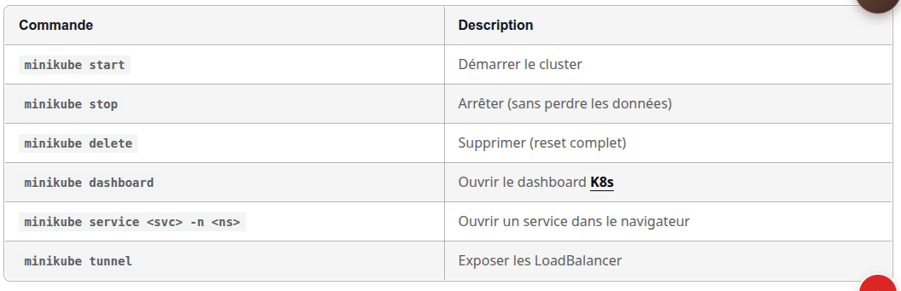

Démarrer Minikube
Créez votre cluster avec suffisamment de ressources pour la formation :

Fenêtre de terminal
minikube start \
--memory=10240 \
--cpus=4 \
--driver=docker \
--kubernetes-version=v1.32.0

10 Go de RAM minimum

L'application OpenTelemetry Demo déploie ~25 pods. Avec 8 Go, certains pods risquent de rester en Pending par manque de ressources. 10 Go est le minimum recommandé.

Driver
Docker
recommandé

Le driver Docker est le plus stable. Si vous préférez VirtualBox ou KVM, adaptez --driver.

Vérifiez que le cluster fonctionne :

Fenêtre de terminal
kubectl cluster-info
kubectl get nodes

Sortie attendue :

Kubernetes control plane is running at https://192.168.49.2:8443
CoreDNS is running at https://192.168.49.2:8443/api/v1/namespaces/kube-system/services/kube-dns:dns/proxy

To further debug and diagnose cluster problems, use 'kubectl cluster-info dump'.

NAME       STATUS   ROLES           AGE     VERSION
minikube   Ready    control-plane   2m14s   v1.32.0

Configurer les addons utiles
Activez quelques addons qui faciliteront le travail :

Fenêtre de terminal
# Metrics server (pour kubectl top)
minikube addons enable metrics-server

# Dashboard Kubernetes (optionnel)
minikube addons enable dashboard

# Ingress (pour exposer les services)
minikube addons enable ingress

Vérifiez les addons actifs :

Fenêtre de terminal
minikube addons list | grep enabled

Ajouter les repos Helm
Ajoutez les repositories Helm nécessaires pour la formation :

Fenêtre de terminal
# Prometheus Community (Prometheus, Alertmanager)
helm repo add prometheus-community https://prometheus-community.github.io/helm-charts

# Grafana (Grafana, Loki, Tempo)
helm repo add grafana-community https://grafana-community.github.io/helm-charts

# OpenTelemetry
helm repo add open-telemetry https://open-telemetry.github.io/opentelemetry-helm-charts

# Mettre à jour les repos
helm repo update

Vérifiez :

$>
helm repo list

Créer les namespaces
Préparez les namespaces pour la formation :

Fenêtre de terminal
# Namespace pour les outils d'observabilité
kubectl create namespace observability

# Namespace pour l'application démo
kubectl create namespace otel-demo

Vérifiez :

Fenêtre de terminal
kubectl get namespaces

# Commandes utiles à retenir

## Dépannage
"Not enough memory"
Réduisez la mémoire allouée (minimum 4 Go, mais 8 Go recommandés) :

Fenêtre de terminal
minikube delete
minikube start --memory=4096 --cpus=2

### "Driver docker not found"
Vérifiez que Docker est démarré :

Fenêtre de terminal
docker ps

Si Docker tourne mais Minikube ne le trouve pas, ajoutez votre utilisateur au groupe docker :

Fenêtre de terminal
sudo usermod -aG docker $USER
newgrp docker

"kubectl connection refused"
Le cluster n'est pas démarré ou le contexte n'est pas bon :

Fenêtre de terminal
minikube start
kubectl config use-context minikube

Validation
Avant de passer au module suivant, vérifiez que tout fonctionne :

Fenêtre de terminal
# Cluster actif
kubectl get nodes

# Namespaces créés
kubectl get ns observability otel-demo

# Repos Helm configurés
helm repo list | grep -E "prometheus|grafana|open-telemetry"

Si tout est vert, vous êtes prêt pour le module suivant.

